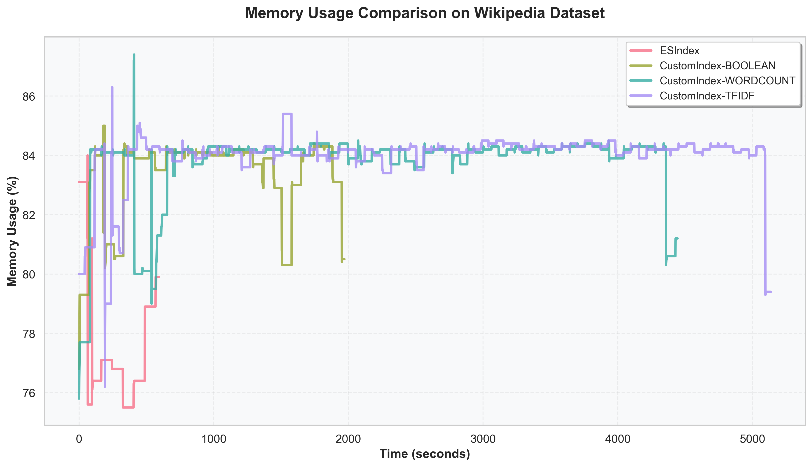
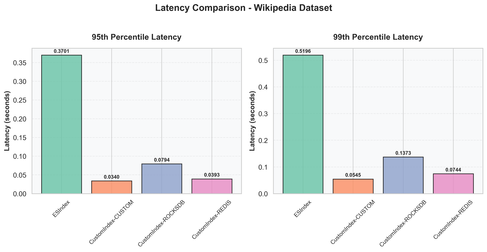
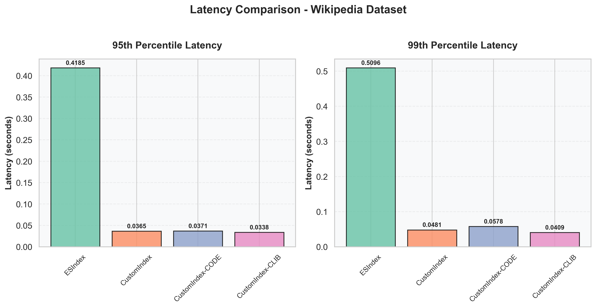
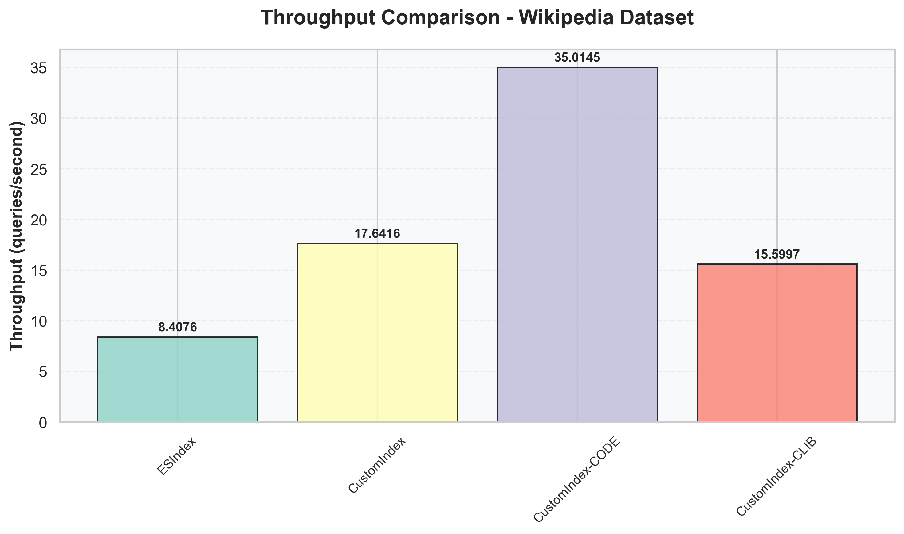
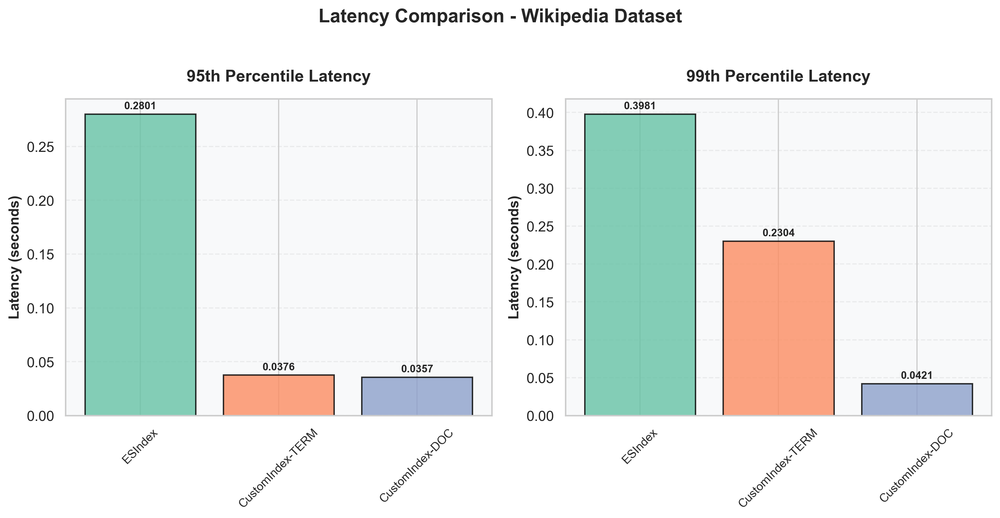
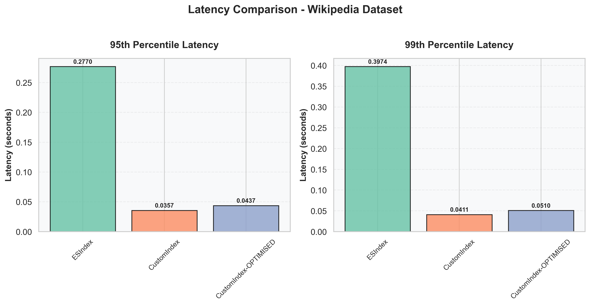

# Results

## Introduction

This section presents the performance evaluation results of our custom information retrieval system compared against Elasticsearch as a baseline. The evaluation encompasses both operational performance metrics (memory usage, latency, throughput) and functional metrics (precision, recall, NDCG, etc.) across different system configurations and datasets.

## Memory Usage Analysis

### Memory Footprint Comparison for Different Index Information Types

This analysis compares the memory consumption during index creation across different index information storage strategies (Boolean, Word Count, TF-IDF) on both News and Wikipedia datasets. The comparison includes Elasticsearch as a baseline to understand the memory overhead of our custom implementations.

**What we're plotting:** Memory usage percentage over time during index creation for different information storage types.

**Datasets:** News and Wikipedia datasets

**Configurations compared:**
- Elasticsearch Index (baseline)
- Custom Index with Boolean information
- Custom Index with Word Count information  
- Custom Index with TF-IDF information

    
    
<em>Figure 1: Memory usage comparison across different index information types</em>

**Implications drawn from the plots:**

We can clearly see that Elasticsearch index takes a lot less space and a lot less time to run as compared to the custom self index.

## Latency, Throughput and Memory Footprint Analysis

### Comparison for Different Data Stores

This section evaluates the query execution latency across different data storage backends to understand the performance impact of various storage mechanisms.

**What we're plotting:** 95th and 99th percentile latencies for query execution across different data store implementations.

**Datasets:** News and Wikipedia datasets

**Configurations compared:**
- Elasticsearch Index (baseline)
- Custom Index with Custom data store
- Custom Index with RocksDB data store
- Custom Index with Redis data store

    
    
<em>Figure 2: Latency comparison for different data store choices</em>

**Implications drawn from the plots:**

The results reveal that Elasticsearch exhibits the highest query latency, primarily attributed to network communication overhead with the Docker-containerized server instance. RocksDB demonstrates comparatively elevated latency due to its internal compression layer, which introduces additional processing overhead. The pronounced tail latency spikes observed at the 95th and 99th percentiles for RocksDB are characteristic of periodic compaction operations inherent to its storage engine architecture.

### Impact of Compression Techniques

This analysis examines how different compression strategies affect query execution latency, providing insights into the trade-offs between storage efficiency and query performance.

**What we're plotting:** 95th and 99th percentile latencies for query execution with different compression methods.

**Datasets:** News and Wikipedia datasets

**Configurations compared:**
- Elasticsearch Index (baseline)
- Custom Index with no compression
- Custom Index with Code compression
- Custom Index with Zlib compression

    
    
<em>Figure 3: Latency comparison for different compression techniques</em>

    
    
<em>Figure 4: Throughput comparison for different compression techniques</em>

**Implications drawn from the plots:**

Elasticsearch demonstrates elevated latency primarily due to network communication overhead with the Docker-containerized server instance. Notably, all three compression techniques exhibit comparable latency characteristics, as the inverted index undergoes decompression only once at query initialization for consecutive query batches, resulting in negligible overhead when processing thousands of queries sequentially.

The throughput analysis reveals some irregularities attributed to occasional bottleneck queries that exhibit significantly higher execution times. These outlier queries disrupt the overall average latency calculations, consequently affecting the measured throughput metrics across all compression methods.

### Query Processing Strategy Performance

This section compares the latency characteristics of Term-at-a-Time (TAAT) versus Document-at-a-Time (DAAT) query processing strategies.

**What we're plotting:** 95th and 99th percentile latencies for different query processing approaches.

**Datasets:** News and Wikipedia datasets

**Configurations compared:**
- Elasticsearch Index (baseline)
- Custom Index with Term-at-a-Time processing
- Custom Index with Document-at-a-Time processing

    
    
<em>Figure 5: Latency comparison for different query processing techniques</em>

    
    
<em>Figure 6: Memory footprint for different query processing techniques</em>

**Implications drawn from the plots:**

The results demonstrate that DAAT exhibits generally lower latency compared to TAAT, while TAAT shows lower memory usage. This counterintuitive memory behavior occurs because TAAT can process posting lists sequentially and discard them immediately after scoring, maintaining only sparse accumulators for relevant documents, whereas DAAT requires maintaining multiple posting list iterators concurrently with their associated buffers and auxiliary data structures (priority queues, heap structures) for coordinating multi-term traversal and enabling efficient early termination, resulting in higher overall memory overhead despite theoretical expectations.

### Optimization Techniques Impact

This analysis evaluates the effectiveness of various optimization techniques in reducing query execution latency.

**What we're plotting:** 95th and 99th percentile latencies comparing optimized versus non-optimized implementations.

**Datasets:** News and Wikipedia datasets

**Configurations compared:**
- Elasticsearch Index (baseline)
- Custom Index without optimizations
- Custom Index with optimizations enabled

    
    
<em>Figure 7: Latency for different optimisation techniques</em>

**Implications drawn from the plots:**
The results demonstrate substantial performance improvements when optimization techniques are enabled, with the optimized implementation consistently achieving lower latency across both 95th and 99th percentiles. Key optimization strategies including enhanced posting list traversal algorithms, early termination strategies, improved memory access patterns, and streamlined data flow contribute to reduced query execution time and more consistent performance under varying load conditions, making these optimizations valuable for production deployment scenarios requiring predictable response times.

## Functional Performance Metrics

### Information Retrieval Effectiveness Comparison

This section evaluates the functional performance of our custom index implementations using standard information retrieval metrics.

**What we're measuring:** The following table explains each evaluation metric used to assess information retrieval effectiveness:

| Metric | Description | Formula/Calculation | Interpretation |
|--------|-------------|-------------------|----------------|
| **MAP** (Mean Average Precision) | Average of precision values at each relevant document position across all queries | Average of AP scores for all queries, where AP = average of precision@k for relevant docs | Higher is better; measures ranking quality and precision across entire result set |
| **NDCG@k** (Normalized Discounted Cumulative Gain) | Measures ranking quality considering position and relevance grades | DCG@k normalized by ideal DCG@k; DCG = Σ(rel_i / log₂(i+1)) | Higher is better (0-1 scale); accounts for graded relevance and position bias |
| **Precision@k** | Fraction of relevant documents in top-k results | (# relevant docs in top-k) / k | Higher is better; measures accuracy of top results regardless of total relevant docs |
| **Recall@k** | Fraction of total relevant documents found in top-k results | (# relevant docs in top-k) / (total relevant docs) | Higher is better; measures completeness of retrieval within top-k |
| **F1@k** | Harmonic mean of Precision@k and Recall@k | 2 × (Precision@k × Recall@k) / (Precision@k + Recall@k) | Higher is better; balances precision and recall trade-off |
| **Accuracy@k** | Overall correctness including true negatives | (TP + TN) / (TP + TN + FP + FN) for top-k | Higher is better; less meaningful for IR due to large true negative space |

**Dataset:** News dataset (using Elasticsearch as ground truth)

**Configurations compared:**
- TF-IDF with Term-at-a-Time processing (no optimization)
- TF-IDF with Document-at-a-Time processing (no optimization)
- TF-IDF with Document-at-a-Time processing (optimized)
- Word Count with Term-at-a-Time processing (no optimization)
- Word Count with Document-at-a-Time processing (no optimization)
- Word Count with Document-at-a-Time processing (optimized)

  <table style="border-collapse: collapse; width: 100%; box-shadow: 0 2px 8px rgba(0,0,0,0.1); border-radius: 8px; overflow: hidden;">
    <thead>
      <tr style="background: linear-gradient(135deg, #667eea 0%, #764ba2 100%); color: white;">
        <th style="padding: 16px 12px; text-align: left; font-weight: 600; font-size: 14px; border: none;">Config</th>
        <th style="padding: 16px 12px; text-align: center; font-weight: 600; font-size: 14px; border: none;">MAP</th>
        <th style="padding: 16px 12px; text-align: center; font-weight: 600; font-size: 14px; border: none;">NDCG@50</th>
        <th style="padding: 16px 12px; text-align: center; font-weight: 600; font-size: 14px; border: none;">Precision@50</th>
        <th style="padding: 16px 12px; text-align: center; font-weight: 600; font-size: 14px; border: none;">Recall@50</th>
        <th style="padding: 16px 12px; text-align: center; font-weight: 600; font-size: 14px; border: none;">F1@50</th>
        <th style="padding: 16px 12px; text-align: center; font-weight: 600; font-size: 14px; border: none;">Accuracy@50</th>
      </tr>
    </thead>
    <tbody>
      <tr style="background-color: #f8f9ff; transition: background-color 0.3s;" onmouseover="this.style.backgroundColor='#e8ebff'" onmouseout="this.style.backgroundColor='#f8f9ff'">
        <td style="padding: 14px 12px; border-bottom: 1px solid #e5e7eb; font-weight: 500; color: #1f2937;">TFIDF-TERM</td>
        <td style="padding: 14px 12px; text-align: center; border-bottom: 1px solid #e5e7eb; color: #374151; font-family: monospace;">0.4483</td>
        <td style="padding: 14px 12px; text-align: center; border-bottom: 1px solid #e5e7eb; color: #374151; font-family: monospace; background-color: #dcfce7; font-weight: 600;">0.5905</td>
        <td style="padding: 14px 12px; text-align: center; border-bottom: 1px solid #e5e7eb; color: #374151; font-family: monospace; background-color: #dcfce7; font-weight: 600;">0.4820</td>
        <td style="padding: 14px 12px; text-align: center; border-bottom: 1px solid #e5e7eb; color: #374151; font-family: monospace; background-color: #dcfce7; font-weight: 600;">0.5534</td>
        <td style="padding: 14px 12px; text-align: center; border-bottom: 1px solid #e5e7eb; color: #374151; font-family: monospace; background-color: #dcfce7; font-weight: 600;">0.4954</td>
        <td style="padding: 14px 12px; text-align: center; border-bottom: 1px solid #e5e7eb; color: #374151; font-family: monospace;">0.9986</td>
      </tr>
      <tr style="background-color: #ffffff; transition: background-color 0.3s;" onmouseover="this.style.backgroundColor='#f3f4f6'" onmouseout="this.style.backgroundColor='#ffffff'">
        <td style="padding: 14px 12px; border-bottom: 1px solid #e5e7eb; font-weight: 500; color: #1f2937;">TFIDF-DOC</td>
        <td style="padding: 14px 12px; text-align: center; border-bottom: 1px solid #e5e7eb; color: #374151; font-family: monospace;">0.4475</td>
        <td style="padding: 14px 12px; text-align: center; border-bottom: 1px solid #e5e7eb; color: #374151; font-family: monospace;">0.5898</td>
        <td style="padding: 14px 12px; text-align: center; border-bottom: 1px solid #e5e7eb; color: #374151; font-family: monospace;">0.4808</td>
        <td style="padding: 14px 12px; text-align: center; border-bottom: 1px solid #e5e7eb; color: #374151; font-family: monospace;">0.5522</td>
        <td style="padding: 14px 12px; text-align: center; border-bottom: 1px solid #e5e7eb; color: #374151; font-family: monospace;">0.4942</td>
        <td style="padding: 14px 12px; text-align: center; border-bottom: 1px solid #e5e7eb; color: #374151; font-family: monospace;">0.9986</td>
      </tr>
      <tr style="background-color: #f8f9ff; transition: background-color 0.3s;" onmouseover="this.style.backgroundColor='#e8ebff'" onmouseout="this.style.backgroundColor='#f8f9ff'">
        <td style="padding: 14px 12px; border-bottom: 1px solid #e5e7eb; font-weight: 500; color: #1f2937;">TFIDF-DOC-OPTIMISED</td>
        <td style="padding: 14px 12px; text-align: center; border-bottom: 1px solid #e5e7eb; color: #374151; font-family: monospace;">0.4475</td>
        <td style="padding: 14px 12px; text-align: center; border-bottom: 1px solid #e5e7eb; color: #374151; font-family: monospace;">0.5898</td>
        <td style="padding: 14px 12px; text-align: center; border-bottom: 1px solid #e5e7eb; color: #374151; font-family: monospace;">0.4808</td>
        <td style="padding: 14px 12px; text-align: center; border-bottom: 1px solid #e5e7eb; color: #374151; font-family: monospace;">0.5522</td>
        <td style="padding: 14px 12px; text-align: center; border-bottom: 1px solid #e5e7eb; color: #374151; font-family: monospace;">0.4942</td>
        <td style="padding: 14px 12px; text-align: center; border-bottom: 1px solid #e5e7eb; color: #374151; font-family: monospace;">0.9986</td>
      </tr>
      <tr style="background-color: #ffffff; transition: background-color 0.3s;" onmouseover="this.style.backgroundColor='#f3f4f6'" onmouseout="this.style.backgroundColor='#ffffff'">
        <td style="padding: 14px 12px; border-bottom: 1px solid #e5e7eb; font-weight: 500; color: #1f2937;">WORDCOUNT-TERM</td>
        <td style="padding: 14px 12px; text-align: center; border-bottom: 1px solid #e5e7eb; color: #374151; font-family: monospace;">0.4294</td>
        <td style="padding: 14px 12px; text-align: center; border-bottom: 1px solid #e5e7eb; color: #374151; font-family: monospace;">0.5692</td>
        <td style="padding: 14px 12px; text-align: center; border-bottom: 1px solid #e5e7eb; color: #374151; font-family: monospace;">0.4598</td>
        <td style="padding: 14px 12px; text-align: center; border-bottom: 1px solid #e5e7eb; color: #374151; font-family: monospace;">0.5312</td>
        <td style="padding: 14px 12px; text-align: center; border-bottom: 1px solid #e5e7eb; color: #374151; font-family: monospace;">0.4732</td>
        <td style="padding: 14px 12px; text-align: center; border-bottom: 1px solid #e5e7eb; color: #374151; font-family: monospace;">0.9985</td>
      </tr>
      <tr style="background-color: #f8f9ff; transition: background-color 0.3s;" onmouseover="this.style.backgroundColor='#e8ebff'" onmouseout="this.style.backgroundColor='#f8f9ff'">
        <td style="padding: 14px 12px; border-bottom: 1px solid #e5e7eb; font-weight: 500; color: #1f2937;">WORDCOUNT-DOC</td>
        <td style="padding: 14px 12px; text-align: center; border-bottom: 1px solid #e5e7eb; color: #374151; font-family: monospace;">0.4337</td>
        <td style="padding: 14px 12px; text-align: center; border-bottom: 1px solid #e5e7eb; color: #374151; font-family: monospace;">0.5749</td>
        <td style="padding: 14px 12px; text-align: center; border-bottom: 1px solid #e5e7eb; color: #374151; font-family: monospace;">0.4660</td>
        <td style="padding: 14px 12px; text-align: center; border-bottom: 1px solid #e5e7eb; color: #374151; font-family: monospace;">0.5374</td>
        <td style="padding: 14px 12px; text-align: center; border-bottom: 1px solid #e5e7eb; color: #374151; font-family: monospace;">0.4794</td>
        <td style="padding: 14px 12px; text-align: center; border-bottom: 1px solid #e5e7eb; color: #374151; font-family: monospace;">0.9986</td>
      </tr>
      <tr style="background-color: #ffffff; transition: background-color 0.3s;" onmouseover="this.style.backgroundColor='#f3f4f6'" onmouseout="this.style.backgroundColor='#ffffff'">
        <td style="padding: 14px 12px; border-bottom: none; font-weight: 500; color: #1f2937;">WORDCOUNT-DOC-OPTIMISED</td>
        <td style="padding: 14px 12px; text-align: center; border-bottom: none; color: #374151; font-family: monospace;">0.4337</td>
        <td style="padding: 14px 12px; text-align: center; border-bottom: none; color: #374151; font-family: monospace;">0.5749</td>
        <td style="padding: 14px 12px; text-align: center; border-bottom: none; color: #374151; font-family: monospace;">0.4660</td>
        <td style="padding: 14px 12px; text-align: center; border-bottom: none; color: #374151; font-family: monospace;">0.5374</td>
        <td style="padding: 14px 12px; text-align: center; border-bottom: none; color: #374151; font-family: monospace;">0.4794</td>
        <td style="padding: 14px 12px; text-align: center; border-bottom: none; color: #374151; font-family: monospace;">0.9986</td>
      </tr>
    </tbody>
  </table>

### Key Findings

**Performance:**
- Elasticsearch: Superior memory efficiency and index creation speed
- DAAT: Lower query latency; TAAT: Lower memory usage
- Optimizations significantly reduce latency without affecting retrieval quality

**Storage:**
- Custom stores and Redis achieve competitive latency
- RocksDB has higher latency due to compression overhead
- Compression provides storage benefits with minimal latency impact

**Effectiveness:**
- TF-IDF outperforms Word Count (MAP: 0.4483 vs 0.4337)
- Processing strategy choice minimally impacts retrieval quality
- Optimizations maintain effectiveness while improving performance

### Recommendations

**Production:**
- Use TF-IDF with DAAT and optimizations for balanced performance
- Use TAAT with Boolean indexing for memory-constrained environments
- Implement custom stores with compression for high-throughput scenarios

**Trade-offs:**
- Elasticsearch: Operational simplicity vs higher resource consumption
- Custom systems: Fine-grained control vs additional development effort
- Compression: Storage efficiency without significant performance degradation

